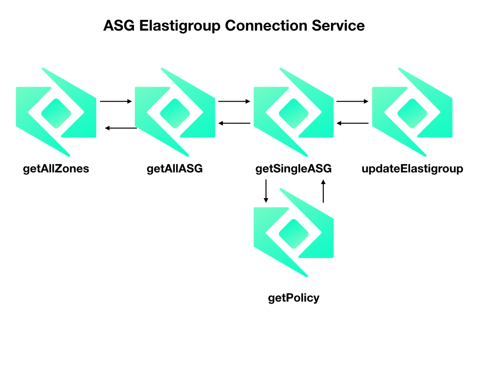

# ASG Elastigroup Connect

This service is used to connect AWS Auto-Scaling Groups with a Spotinst Elastigroup so changes that are made to the ASG will be refected in the corresponding Elastigroup. 

## Notes
 * The heartbeat of this function is a cron that is controlled in the `getAllZones` function to change the frequency go to the console and under the Trggers tag you can update it
 * This function *CANNOT* update the following:
 	* Load Balancers
 	* Avaiabily Zones and Subnets
 	* Target number of capacity units (You are able to change the Min and Max capacity units)
 * Default cooldown for Scaling Polcies will be set to the closest multiple of 60 

## Function Description

 * [Get All Zones](./docs/getAllZones.md)
 * [Get All ASG](./docs/getAllASG.md)
 * [Get Single ASG](./docs/getSingleASG.md)
 * [Get Policy](./docs/getPolicy.md)
 * [Update Elastigroup](./docs/updateElastigroup.md)

<!-- 
 -->